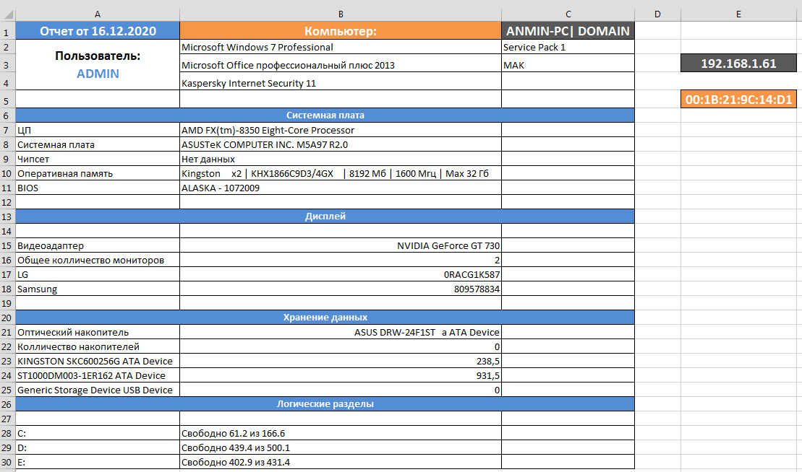

[](https://github.com/beryx-gist/badass-jlink-example-kotlin-tornadofx/blob/master/LICENSE)

# Скрипты автоматизирующие некоторые действия системного администратора

## CMD:

* [Добавление системных переменных](cmd/AddPath.cmd)
* [Список ip-адресов](cmd/My%20IP.cmd)
* [Сброс кеша DNS](cmd/ClearDNS.cmd)
* [Очистка печати и перезапуск службы](cmd/RestoreSpooler.cmd)
* [Очистка директории (с уникальными поддиректориями которые чистить не нужно)](cmd/ClearFolder.cmd)
* [Смена адреса сервера администрирования в KasperskyAgent](cmd/KasperskyAgentAddress.cmd)
* [Найти ip-адрес по MAC](cmd/FindIPonMAC.cmd)
* [Подключение шары](cmd/AddShare.cmd)

## POWERSHELL:

* [Добавление компа в домен](powershell/AddComputerToDomain.ps1)
* [Создание задач в планировщике](powershell/CreateJobSheduller.ps1)
* [Быстрое создание студенческих аккаунтов](powershell/FastCreatedStudentAccaunt.ps1)
* [Вывод из домена и обратно](powershell/ReConnectComuterToDomain.ps1) (если комп потерял домен)
* [Поиск устаревших и неиспользуемых компов в домене](powershell/FindOldComputers.ps1)
* [Поиск неактивных пользователей в домене](powershell/FindOldUsers.ps1)
* [Переименовать файлы в указанной директории](powershell/FilesRenamer.ps1) (Переименование по маске)
* [Добавление программы в "Мой Компьютер"](powershell/AddProgrammInMyPC.ps1)
* [Импорт пользователей из CSV](powershell/ImportUserListFromCSV.ps1)
* [Информация об ОЗУ](powershell/Memory.ps1)
* [Информация об мониторах](powershell/Monitors.ps1)
* [Инвентаризация](powershell/PCReportV01.ps1) (Простая)
* [Запустить скрипт как службу](powershell/RunScriptOnService.ps1)
* [Экспорт компов домена в CSV](powershell/ExportAllPc.ps1)
* [Пример внедрения кода на JS](powershell/JS-Test.ps1)
* [Пример GUI](powershell/GUI.ps1)

---

* [Инвентаризация](powershell/PCReport.ps1) - данный скрипт собирает информацию о компах в домене и для каждого создает
  Excel-документ содержащий паспорт компьютера (Может быть косяк с Windows XP). Можно совместить с 
  [планировкой инвентаризации](powershell/ReportSchedule.ps1).



### License

```
Licensed to the Apache Software Foundation (ASF) under one or more contributor
license agreements. See the NOTICE file distributed with this work for
additional information regarding copyright ownership. The ASF licenses this
file to you under the Apache License, Version 2.0 (the "License"); you may not
use this file except in compliance with the License. You may obtain a copy of
the License at

http://www.apache.org/licenses/LICENSE-2.0

Unless required by applicable law or agreed to in writing, software
distributed under the License is distributed on an "AS IS" BASIS, WITHOUT
WARRANTIES OR CONDITIONS OF ANY KIND, either express or implied. See the
License for the specific language governing permissions and limitations under
the License.
```